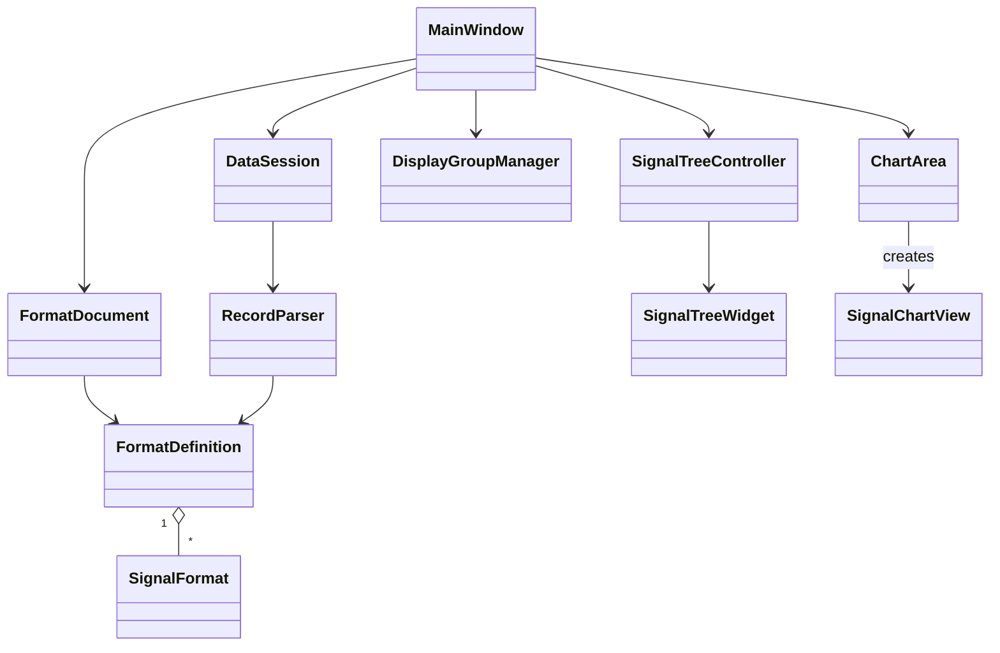

# PAT 当前实现框架设计

## 总览
当前实现采用“核心解析 + Qt UI 展示”的分层结构，核心仅负责格式解析与数据解析，界面层负责交互、分组与图表展示。

- 核心层（`src/core`）
  - `FormatDefinition`：格式字段定义与 JSON 解析
  - `FormatDocument`：格式文件加载/保存与文本管理
  - `RecordParser`：二进制数据解析
  - `DataSession`：数据加载与统计信息（min/max/时间跨度）
- 界面层（`src/ui`）
  - `MainWindow`：入口与模块编排
  - `SignalTreeWidget`：信号树 UI 与拖拽 MIME
  - `SignalTreeController`：信号树构建与选中状态管理
  - `DisplayGroupManager`：信号分组与合并规则
  - `ChartArea`：图表区域容器与共享时间轴
  - `SignalChartView`：单图表交互（缩放、平移、框选、游标、拖拽合并）
  - `FormatEditorDialog`：格式编辑与验证对话框

## 类图（Mermaid）

## 子系统关系
- 核心子系统（解析）
  - `FormatDocument` 维护格式文本与 `FormatDefinition`。
  - `RecordParser` 按 `FormatDefinition` 解析数据文件，统一时间轴单位。
  - `DataSession` 管理解析结果与统计信息，向 UI 提供 `Series` 与 `SeriesStatistics`。
- UI 子系统（展示）
  - `SignalTreeWidget` 只负责树形显示与拖拽 MIME。
  - `SignalTreeController` 负责树构建与勾选状态，输出需要展示的信号集合。
  - `DisplayGroupManager` 将“勾选信号 + 合并规则”转为展示分组。
  - `ChartArea` 管理子画布列表、共享时间轴与游标同步。
  - `SignalChartView` 负责单图交互（缩放、平移、框选、右键菜单、拖拽合并）。

## 数据流与控制流
1. 格式加载
   - `MainWindow` 调用 `FormatDocument::LoadFromFile` 得到 `FormatDefinition`。
   - `SignalTreeController::Build` 根据 `group` 与 `groups.path` 构建树形结构。
2. 数据加载
   - `MainWindow` 使用 `DataSession::Load` 解析数据，生成 `Series` 与统计信息。
3. 展示更新
   - `DisplayGroupManager::UpdateGroups` 将“信号勾选 + 合并规则”转化为展示分组。
   - `ChartArea::BuildCharts` 按组创建 `SignalChartView`，并应用共享时间轴。
4. 交互同步
   - `SignalChartView` 发出缩放/平移/框选请求，`ChartArea` 计算并应用新的 X 轴范围。
   - 游标移动由 `SignalChartView` 触发，`ChartArea` 统一更新所有子图游标。
   - 拖拽合并由 `SignalChartView` 触发，`MainWindow` 调用 `DisplayGroupManager` 更新分组。

## 关键设计点
- 分层与内聚
  - 解析逻辑全部位于 `core`，界面层不直接操作解析细节。
  - 合并规则独立在 `DisplayGroupManager`，避免 UI 与数据耦合。
- 共享时间轴
  - `ChartArea` 负责统一 X 轴范围与游标同步。
  - `FormatDefinition.timeAxisUnit` 作为统一时间单位，解析阶段完成换算。
- 大数据展示
  - `ChartArea` 对数据进行抽稀显示（可配置最大显示点数）。
- 分组展示
  - 通过 `group` 路径与可选 `groups` 描述，实现分组树与多列展示。

## 目录与文件分布
- 核心：`src/core/FormatDefinition.*`、`src/core/FormatDocument.*`、`src/core/RecordParser.*`、`src/core/DataSession.*`
- 界面：`src/ui/MainWindow.*`、`src/ui/SignalTreeWidget.*`、`src/ui/SignalTreeController.*`、`src/ui/DisplayGroupManager.*`、`src/ui/ChartArea.*`、`src/ui/SignalChartView.*`、`src/ui/FormatEditorDialog.*`

## 可扩展点（后续改进参考）
- 多数据集/多格式并行解析与展示
- 异常检测规则（阈值/区间/离群点）
- 解析进度与异步加载（大文件 UI 不阻塞）
- 统计面板（每信号 min/max/均值等）
- 时间轴单位自动换算与显示策略
